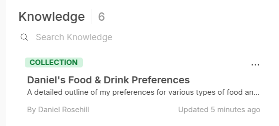
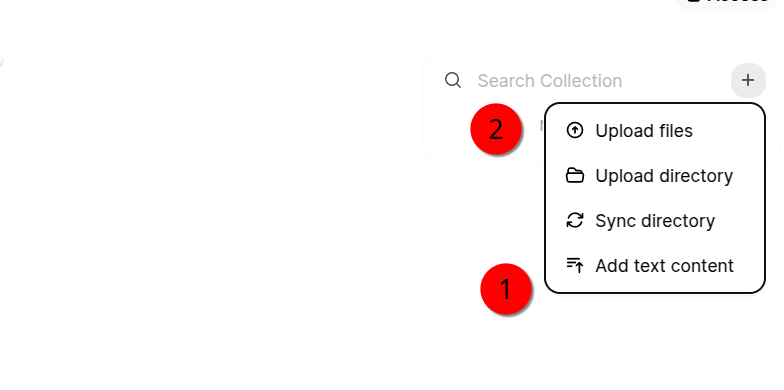

# Personal Contextual Data Store Ideation (AI, Pick Me A Beer!)

09-Jan-25

Large language models can be rendered expotentially more powerful by the addition of small amounts of contextual data. 

To build on the previous work and experimentation I've done around this theme, this repository contains a few prompts and outputs designed to use AI to ideate the different contextual data stores that may be advantageous for this purpose. 

The idea here is to support the kind of implementation of RAG (for personal use) that is already available in many large language model front ends, including Open Web UI and others. 

I've looked at a few ways to develop data pipelines in order to allow users to develop these knowledge repositories locally and then push them into vector stores for embedding in LLM workflows.

 The purpose of this project is to develop a workflow to "seed" a starting bank of context data that can lay the groundwork for a rich data store segmented into different vaults for use with different agents. 

The objective in this, and all my experiments in finding ways to leverage personal contextual data is to achieve something that grows closer to delivering truly personalised experiences with LLMs.

## Assistant For Context Development 

This assistant provides randomized suggestions for vaults of personal context knowledge as well as individual files that should be populated within it, providing short descriptions for what those context data files should contain. 

##  Starter Ideas For Personal Context Generation 

I've gathered some outputs from the assistant in the `starters` folder.

Those who share my enthusiasm about the huge potential of personal contextual data to generate better LLM outputs can begin their day by making a few cups of coffee, signing up for a good speech to text assistant, and working through the suggestions.  

Create the recommended knowledge stores (or those which make sense for your particular AI/LLM needs), jot down or record the requisite files, upload them when finished, set the right embedding settings, and finally, connect them to the assistants or agents that make sense.

While this process sounds tedious even as I write it out, doing this even a few times has already proven very useful. 

## Example Data Stores

Purely for demonstration purposes, a few sample files of context data about my preferences in Food and Drink are included in the repo, just to share the idea.

---

# Demo: How This Works

I'll use OpenWebUI to demonstrate as they have nice support for knowledge stores. But the idea is the same. However, you want to pair a large language model with a knowledge store or vector database. Perhaps you can think of it as "RAG, but for simple use."

## 1: Create a data context store

For the purpose of demonstration, I created a small collection of files in this repository, providing some simple notes about my preferences in various types of food and alcohol. 

 Each file has a descriptive name to assist in retrieval. And within each file there are some details relevant to that topic. For example, in `cider.md` I have:

 >I love extra dry cider. In fact, I don't think I've ever drunk a cider that I found too dry.  Bulmers is about the sweetest cider that I can tolerate.

 I generated these simply by speaking for a few minutes into dictation software. It saves time.

 ## 2: Create your data store

 Now I'm going to create a knowledge store to house this data. 
 
 Under the hood this will be embedded. The bright people behind Open Web UI can undoubtedly tell you vastly more than I can about the mechanisms of vector and embeddings. They have a really nice UI for doing this. And unlike when using OpenAI Assistants API, you're not constrained to using just the model by the platform. 

 So I created the knowledge store for this information:

 

 A nice feature in Open Web UI that is ideal for this kind of use case is the ability to directly add text content into the context data. 

 

 But in this case I'm simply going to upload the files that I already captured locally.

 This only takes a second because markdown files are absolutely tiny, as you can see by the filesizes. Any more elegant implementation? A pipeline could be implemented to push this data up from a repository. But simply uploading files one by one is easy enough. 

 

 The implementation in Open Web UI is truly excellent. Not only can you import the files easily and view what is in the knowledge store, you can edit them within the data stores:

 

 While it's true that there's nothing revolutionary about the ability to edit a text file in a browser, being able to run dynamic retrievals against that data and feed it to a large language model is impressive.

 This might be highly useful in the context of, for example, a job search. 

If I wanted to create an assistant for the purpose of helping with a job search. I could maintain a file of my ongoing applications and update the notes when I get rejections or when I'm in an interview process. Now, when I ask the model to tailor its recommendations for companies that might be hiring, it can consider this within its context. 

 

 ## 3: Build Your Tool!

 Now we're almost ready to put everything together. 

 To create a functional agent with my food and drink preferences as its knowledge, I'll firstly create a model which can use a system prompt (1) and a connection to a knowledge store (2) to effectively replicate the kind of functionality seen in tools like Custom GPT, OpenAI Assistants (etc).

 

 Here's my system prompt:

 >You are the personal food recommendation assistant for Daniel Rosehill. Refer to Daniel's food and drink preferences in your knowledge. Daniel might upload a menu or tell you where he is and what's available, and you can make some recommendations based upon what you know about his preferences.

 Finally, I'm connecting this model to the knowledge store that I just created:

Now we're ready to go! Let's run a quick test prompt:

The response isn't brilliant and the parameters probably need some more tweaking, but it demonstrates that the tool was able to look up the knowledge story. You can see the two specific files from among the various context data that I uploaded:

## What beer should I order?

Let's try something far more interesting. 

If this thing can't make a beer recommendation, then we may as well just pack up. 

I pulled a random beer menu from the Internet in order to see if the assistant could work with its vision capabilities and my preferences in its knowledge. 

From here it's pretty basic, just a quick instruction and I uploaded the beer menu screen shot for context.

 

 And we have a successful implementation!

 

 I love Fiddlehead and this is pretty much exactly what I would have ordered.

 Success!

## Send Ideas, Thoughts!

I love getting emails from people who are also working on AI ideas, and especially trying to think about ways to better leverage personal context for the type of workflows that it can support so well

## Author

Daniel Rosehill  
(public at danielrosehill dot com)

## Licensing

This repository is licensed under CC-BY-4.0 (Attribution 4.0 International) 
[License](https://creativecommons.org/licenses/by/4.0/)

### Summary of the License
The Creative Commons Attribution 4.0 International (CC BY 4.0) license allows others to:
- **Share**: Copy and redistribute the material in any medium or format.
- **Adapt**: Remix, transform, and build upon the material for any purpose, even commercially.

The licensor cannot revoke these freedoms as long as you follow the license terms.

#### License Terms
- **Attribution**: You must give appropriate credit, provide a link to the license, and indicate if changes were made. You may do so in any reasonable manner, but not in any way that suggests the licensor endorses you or your use.
- **No additional restrictions**: You may not apply legal terms or technological measures that legally restrict others from doing anything the license permits.

For the full legal code, please visit the [Creative Commons website](https://creativecommons.org/licenses/by/4.0/legalcode).